# The **Schticks Text** font family

The **Schticks Text** font family is an OFL-licensed fork of the **STIX Two Text** fonts (by Ross Mills, Tiro Typeworks Ltd), with a wider weight range and a width range.

## Font downloads

* [SchticksText-OTF (163 fonts, version 102.000)](https://github.com/twardoch/schticks-fonts-ofl/blob/master/Schticks/Fonts/SchticksText-OTF.zip?raw=true)
* [SchticksText-TTF (163 fonts, version 102.000)](https://github.com/twardoch/schticks-fonts-ofl/blob/master/Schticks/Fonts/SchticksText-TTF.zip?raw=true)

## Resources

* The **Schticks Text** family files (the font sources and build scripts) are in the [`Schticks`](Schticks/) folder.
* The original **STIX Two Text** files are in the [`STIXv2`](STIXv2/) folder, taken from [Sourceforge](https://sourceforge.net/projects/stixfonts/files/Current%20Release/STIXv2.0.0.zip/download)
* The [`STIXv2`](STIXv2/) folder also contains comparison showings between the **STIX Two** fonts and **Cambria**, **TeX Gyre Termes** and **XITS**.

## Credits and License

### License

* The fonts are licensed under the [SIL Open Font License version 1.1](./fonts.LICENSE).
* The license field says:

> As a condition for receiving these fonts at no charge, each person downloading the fonts must agree to some simple license terms. The license is based on the SIL Open Font License <http://scripts.sil.org/cms/scripts/page.php?site_id=nrsi&id=OFL>. The SIL License is a free and open source license specifically designed for fonts and related software. The basic terms are that the recipient will not remove the copyright and trademark statements from the fonts and that, if the person decides to create a derivative work based on the STIX Fonts but incorporating some changes or enhancements, the derivative work ("Modified Version") will carry a different name. The copyright and trademark restrictions are part of the agreement between the STI Pub companies and the typeface designer. The "renaming" restriction results from the desire of the STI Pub companies to assure that the STIX Fonts will continue to function in a predictable fashion for all that use them. No copy of one or more of the individual Font typefaces that form the STIX Fonts(TM) set may be sold by itself, but other than this one restriction, licensees are free to sell the fonts either separately or as part of a package that combines other software or fonts with this font set.

* All the tools and other content are licensed under the [Apache License version 2.0](./other.LICENSE).

### Designers

* **STIX Two** design: Ross Mills, Tiro Typeworks Ltd, with portions MicroPress Inc., with final additions and corrections provided by Coen Hoffman, Elsevier (retired)
* **Schticks Text** modification and expansion: Adam Twardoch

### Copyright

* Copyright © 2017 by [Adam Twardoch](https://github.com/twardoch/).
* Copyright (c) 2001-2016 by the STI Pub Companies, consisting of the American Chemical Society, the American Institute of Physics, the American Mathematical Society, the American Physical Society, Elsevier, Inc., and The Institute of Electrical and Electronic Engineers, Inc.
* Portions copyright (c) 1998-2003 by MicroPress, Inc.
* Portions copyright (c) 1990 by Elsevier, Inc.  All rights reserved.

### Description

> Arie de Ruiter, who in 1995 was Head of Information Technology Development at Elsevier Science, made a proposal to the STI Pub group, an informal group of publishers consisting of representatives from the American Chemical Society (ACS), American Institute of Physics (AIP), American Mathematical Society (AMS), American Physical Society (APS), Elsevier, and Institute of Electrical and Electronics Engineers (IEEE). De Ruiter encouraged the members to consider development of a series of Web fonts, which he proposed should be called the Scientific and Technical Information eXchange, or STIX, Fonts. All STI Pub member organizations enthusiastically endorsed this proposal, and the STI Pub group agreed to embark on what has become a twelve-year project. The goal of the project was to identify all alphabetic, symbolic, and other special characters used in any facet of scientific publishing and to create a set of Unicode-based fonts that would be distributed free to every scientist, student, and other interested party worldwide. The fonts would be consistent with the emerging Unicode standard, and would permit universal representation of every character. With the release of the STIX fonts, de Ruiter's vision has been realized.

### Trademark

STIX Fonts(TM) is a trademark of The Institute of Electrical and Electronics Engineers, Inc.

### Specimen

* [Schticks Text Overview PDF](Schticks/Media/Schticks-Text-Overview.pdf)
* [Schticks Text Specimen PDF](Schticks/Media/Schticks-Text-Specimen.pdf)
* [Schticks Text Glyph Set PDF](Schticks/Media/Schticks-Text-Glyphset.pdf)

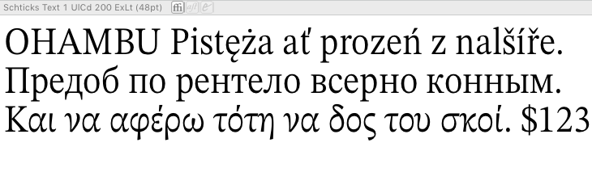
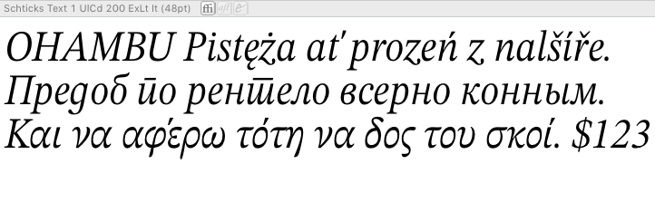
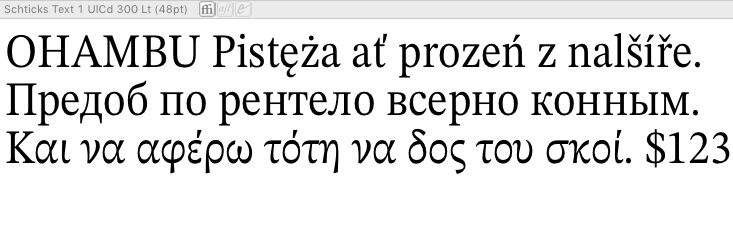

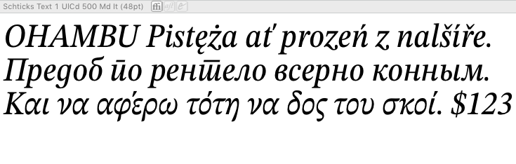
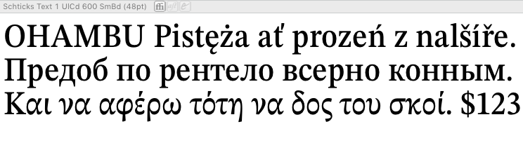
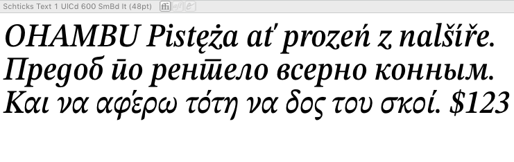
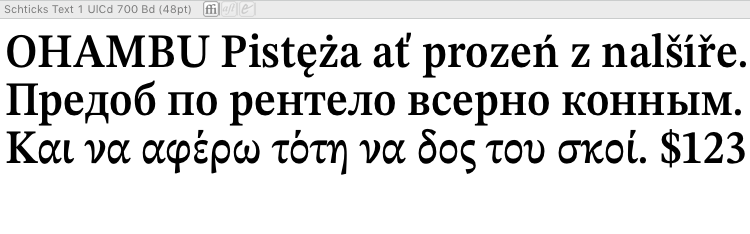
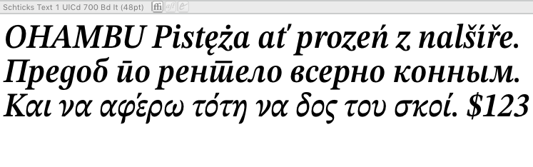
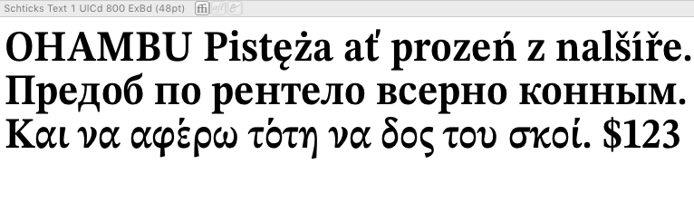
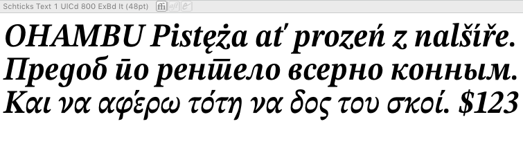
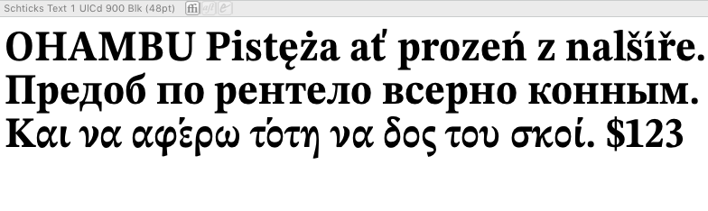
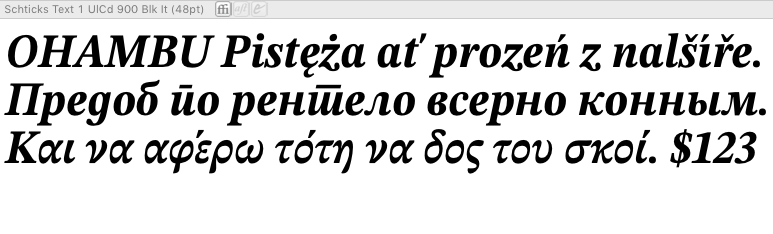
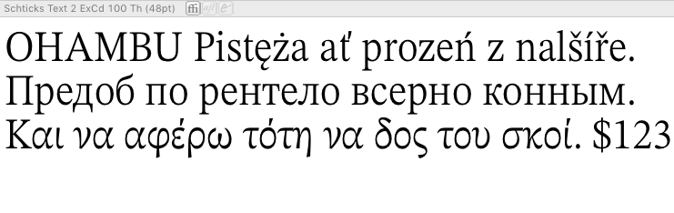

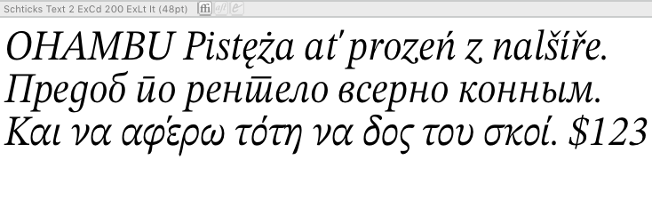
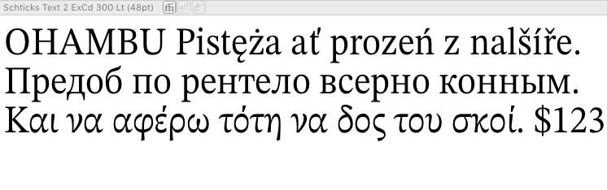

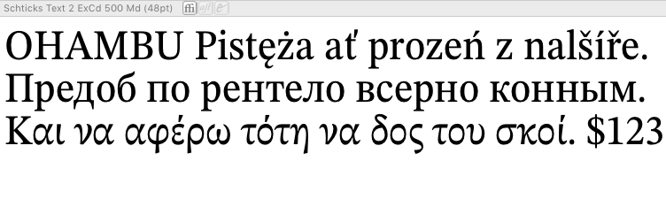
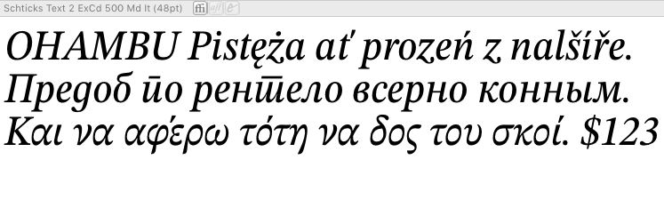

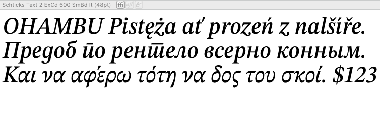

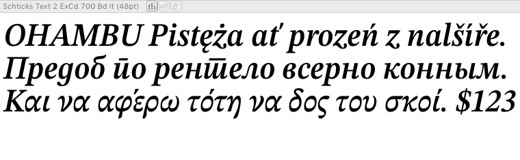

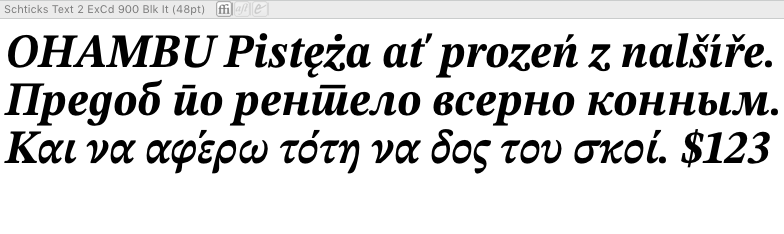

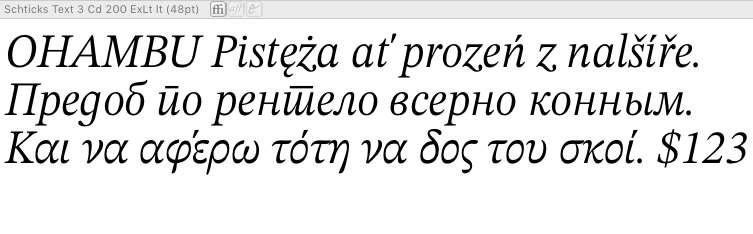

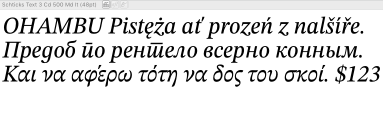
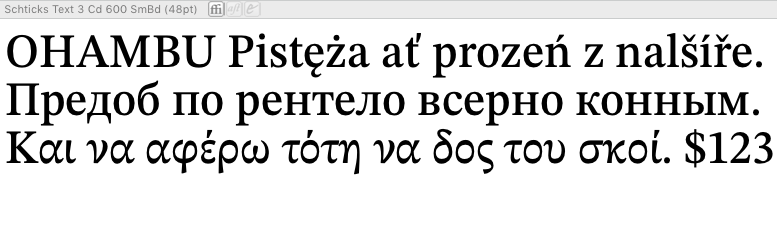

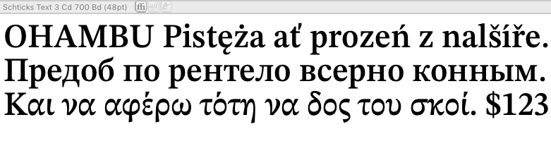
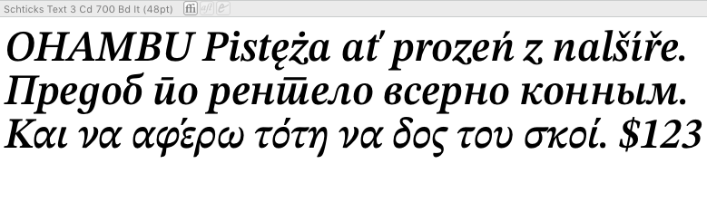

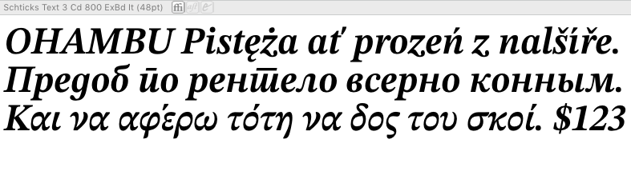

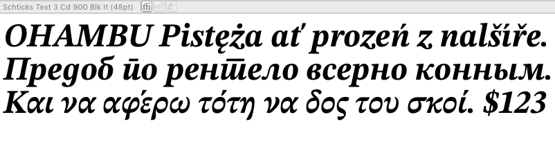
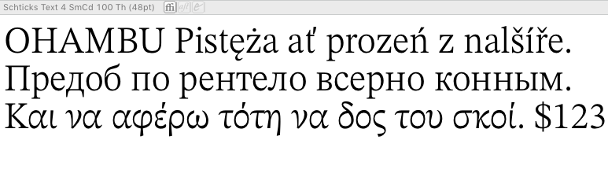

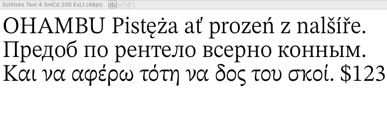

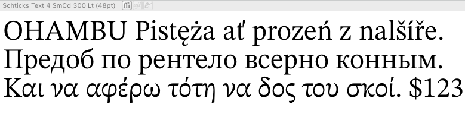

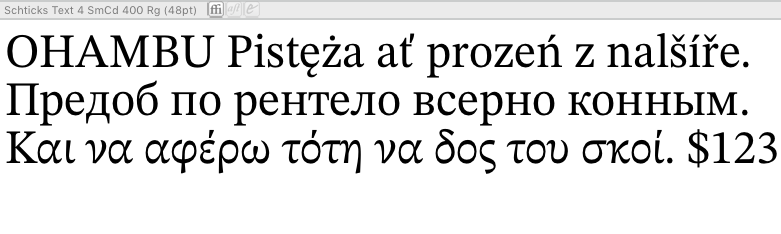

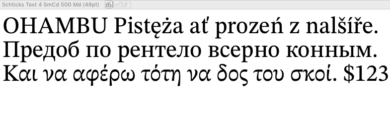

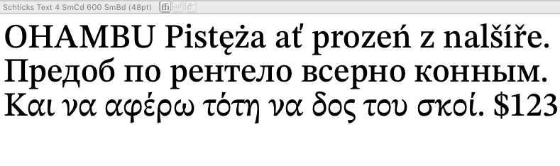
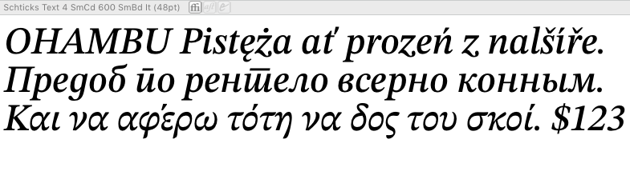

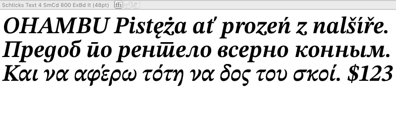

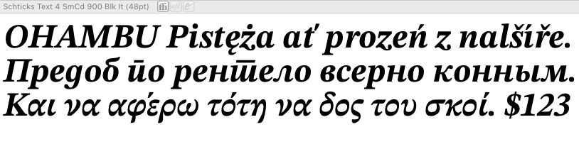

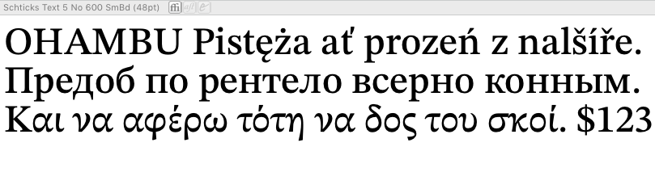

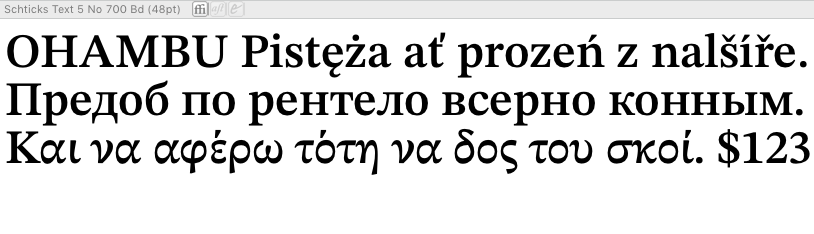
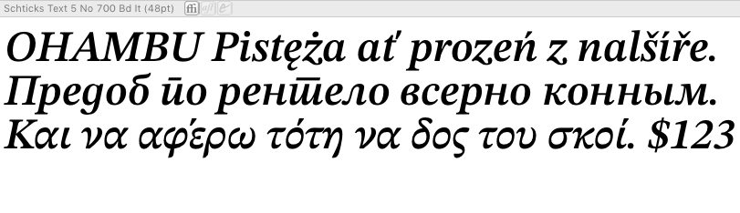
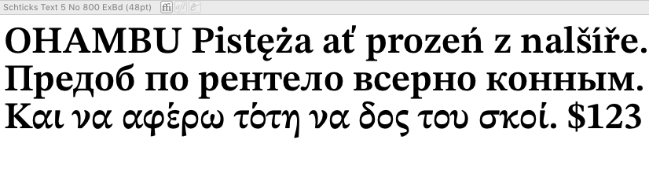
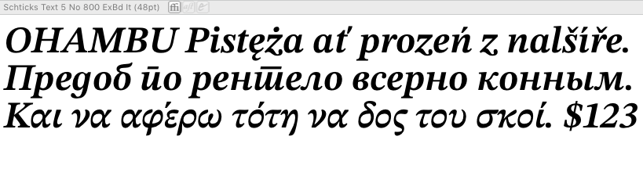

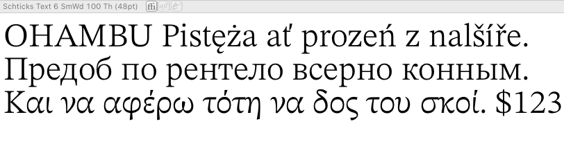
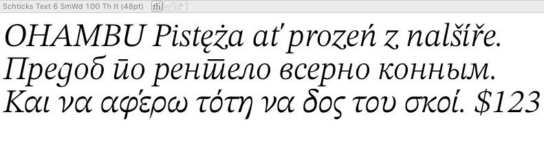

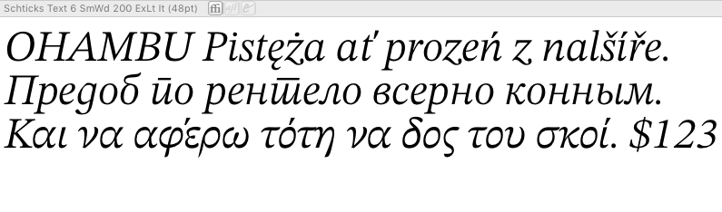
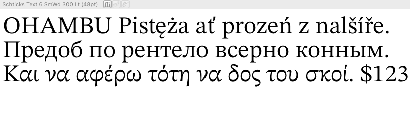

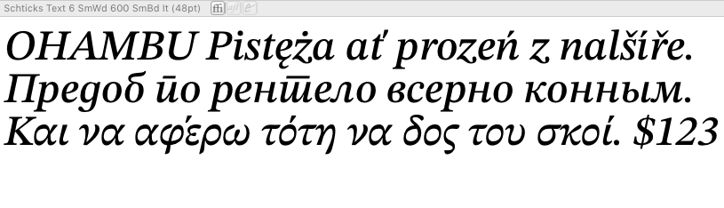
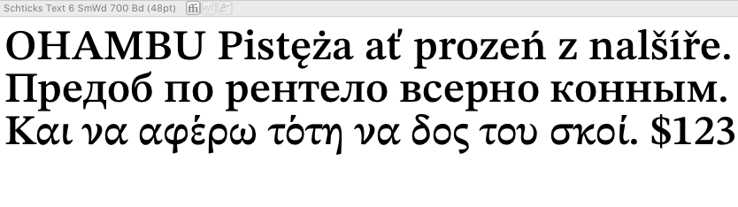

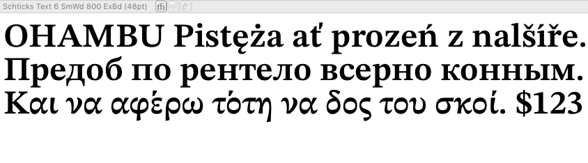

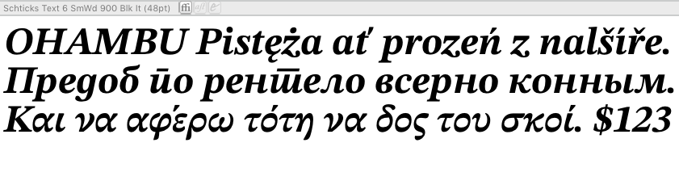

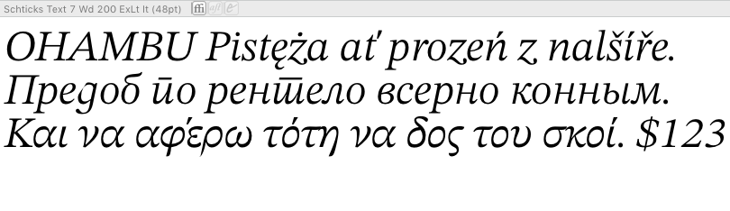

## Development Notes

#### 2017-01-27

Problems described in [fontmake-problems.md](Schticks/Sources/fontmake-problems.md) prohibit me from making a variable font at this point.

#### 2017-01-26

Two glyphs not compatible after MM: `uni025F` and `uni02A6`.

